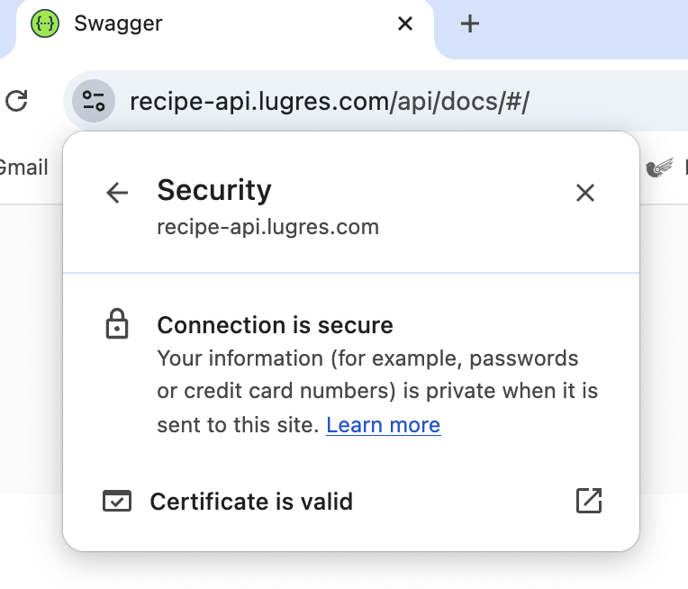
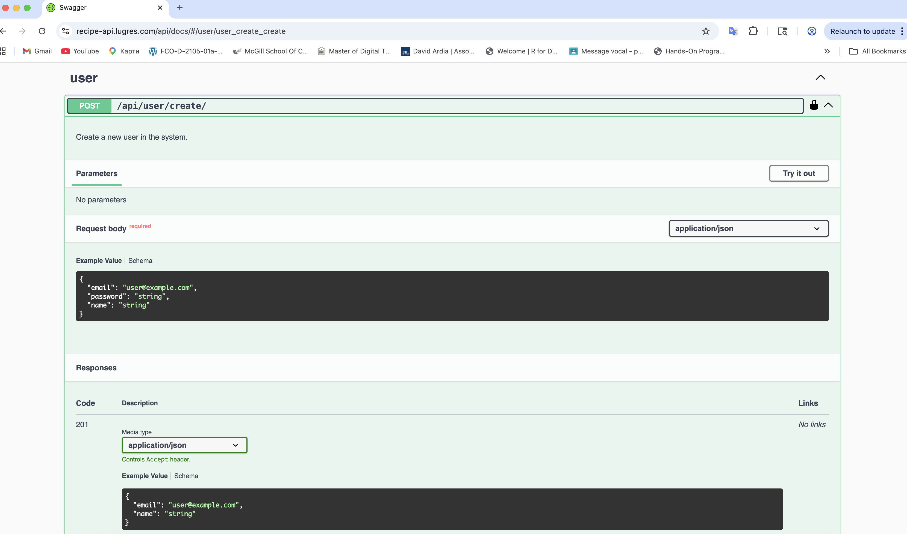
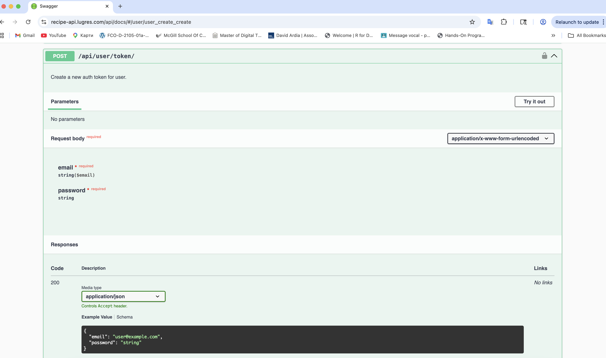
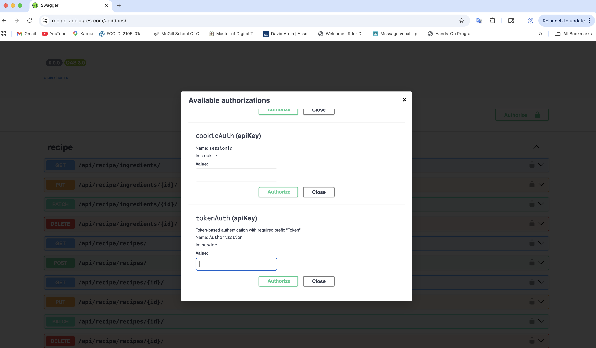
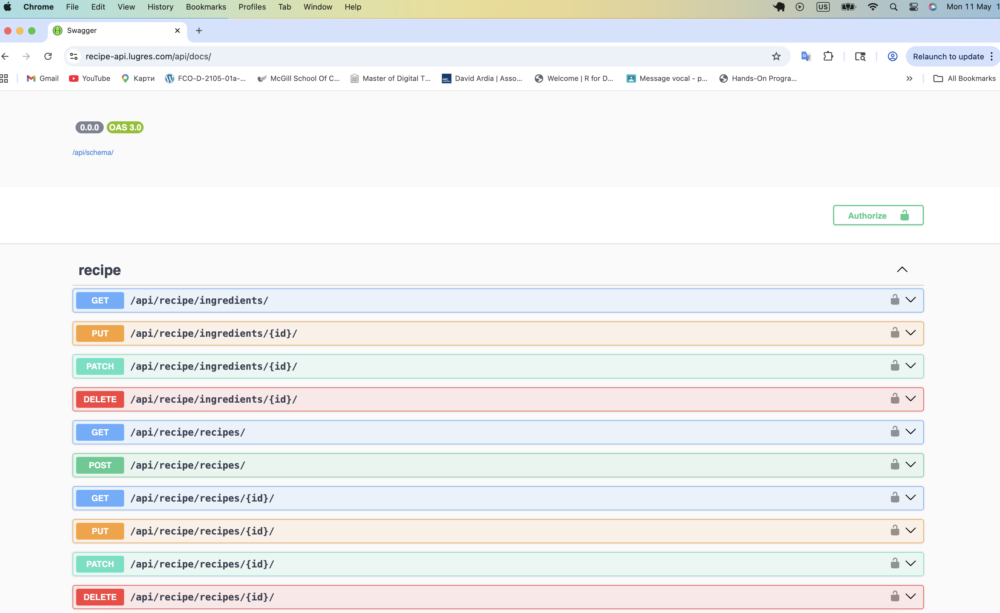
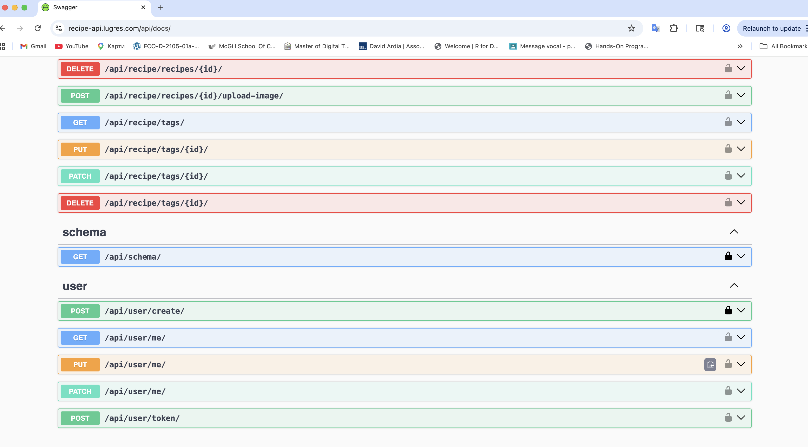
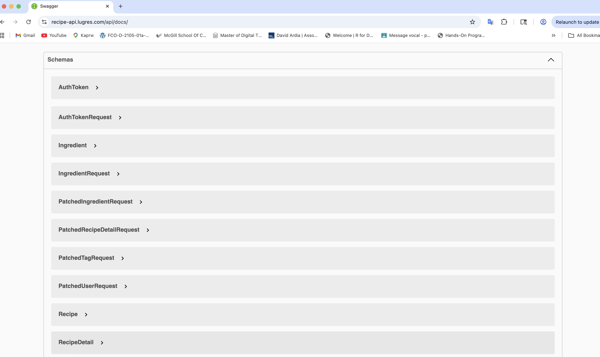

# recipe-api
Recipe API project. 

The Recipe app is a backend REST API built using Python, Django, Django REST Framework, Docker, GitHub Actions, Postgres and Test Driven Development.

App handles:
 - User token-based authentication on top of the custom user model
 - Creating objects (recipes, ingredients, tags)
 - Filtering and sorting objects
 - Uploading and viewing images

The app's functionality is firmly covered by more than 60 unit tests developed using TDD approach.

The API is designed to be used as follows:
1) When a user creates or updates a recipe, the user would want to specify tags/ingredients for that recipe. For convenience, the API will handle this in one request. 
2) If the user wants to delete or update an ingredient/tag, then they can do this directly via the tags/ingredients API, and this will be updated for all recipes the tags/ingredients are assigned too.

The project is deployed on AWS Cloud using EC2 instance with Docker containers and docker-compose to orchestrate them (Django app, PostgreSQL DB, Nginx proxy, Certbot tool), and it makes use of free SSL certs by Let'sEncrypt.

You can explore the project here (**currently EC2 is stopped due cost saving reasons, ask me if you want to see it up-and-running again**):
https://recipe-api.lugres.com/api/docs

To get a feeling of the app, please create a user first via respective API endpoint, then get a token for the user. After that you will be able to Authorize at the top with the token (use syntax "Token your_token") and use the app's functionality. 

The project is based on Udemy course by Mark Winterbottom.
https://www.udemy.com/course/django-python-advanced

### A sneak-peak of the running Recipe API on AWS EC2 instance

Your connection is always secure, protected by the means of an SSL certificate from Let's Encrypt:

1. Create a user:

2. Create a token for the user:

3. Get authorized using the token:

4. Now you're able to get, create, modify recipes and perform other operations using corresponding API endpoints:

...

...
